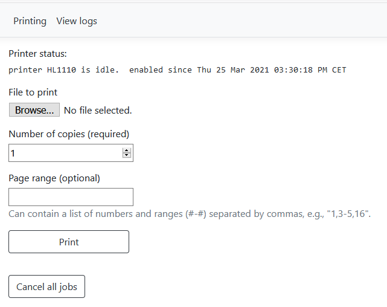

This application is my hobby project and solves a very specific task. It is not production ready.<br>

# Description
Web interface for my printer "Brother HL1110" built using [ROCK Pi X](https://rockpi.org/#rockpix) board and ASP .NET Core.


# Configure of Ubuntu 20.10
```
# Passwordless sudo
sudo visudo /etc/sudoers
# add at the end of the file:
user ALL=(ALL) NOPASSWD:ALL

# Disable sleep
sudo systemctl mask sleep.target suspend.target hibernate.target hybrid-sleep.target

# Configure wifi drivers
# download "AP6255_BT_WIFI_Firmware.zip" from https://wiki.radxa.com/RockpiX/downloads
pscp.exe -pw <password> -r C:\Users\<username>\Downloads\AP6255_BT_WIFI_Firmware user@<IP>:/home/user/
sudo cp AP6255_BT_WIFI_Firmware/BT_WIFI_Firmware/wifi/brcmfmac43455* AP6255_BT_WIFI_Firmware/BT_WIFI_Firmware/bt/BCM4345C0.hcd  /lib/firmware/brcm/
mv "/lib/firmware/brcm/brcmfmac43455-sdio.ROCK Pi-ROCK Pi X.txt" "/lib/firmware/brcm/brcmfmac43455-sdio.Radxa-ROCK Pi X.txt"
sudo shutdown -r now

# Configure Ethernet and Wifi adapters
user@rockpix:~$ cat /etc/netplan/00-installer-config.yaml
network:
  version: 2
  ethernets:
    enp1s0:
      optional: true
      dhcp4: yes
  wifis:
    wlan0:
      optional: true
      access-points:
        "<access poit name>":
          password: "<password>"
      dhcp4: true

sudo netplan --debug apply

# Configure time
sudo timedatectl set-timezone <timezone name>
sudo systemctl restart systemd-timesyncd
timedatectl timesync-status

# Configure cups and HL1110 drivers
sudo apt-get install cups libc6-i386
# download "LPR printer driver (deb package)" and "CUPSwrapper printer driver (deb package)"
# https://support.brother.com/g/b/downloadlist.aspx?c=us_ot&lang=en&prod=hl1110_us_eu_as&os=128#SelectLanguageType-561_0_1
sudo dpkg -i --force-all hl1110lpr-3.0.1-1.i386.deb hl1110cupswrapper-3.0.1-1.i386.deb
lpoptions -p HL1110 -o Resolution=600dpi
# show info
sudo lpinfo -v
lpoptions -p HL1110 -l
lpstat -v
# show all jobs
lpstat -l -W all -o
# make cups log to journald
sudo nano /etc/cups/cups-files.conf
# add:
AccessLog syslog
ErrorLog syslog
PageLog syslog
# print
lp -p HL1110 -o media=A4 -o print-quality=5
# cancel all jobs
cancel HL1110
```

# How to install the SW
* Download the latest [release](https://github.com/PolarGoose/PrinterWebInterface/releases)
* Copy to the target via ssh: `pscp.exe -pw <password> -r PrinterWebInterface user@<ip>:/home/user/`
* On the target do execute the following commands:
```
chmod +x /home/user/PrinterWebInterface/PrinterWebInterface
sudo mv /home/user/PrinterWebInterface.service /etc/systemd/system/
sudo systemctl enable PrinterWebInterface
sudo systemctl start PrinterWebInterface
# check log
journalctl -e
```
* In browser open `http://<ip>:5001`
